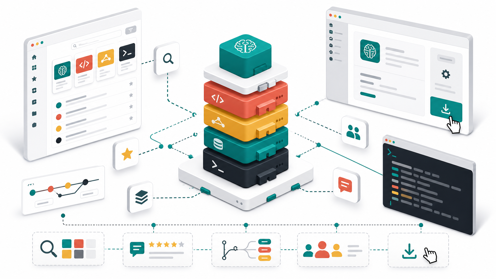
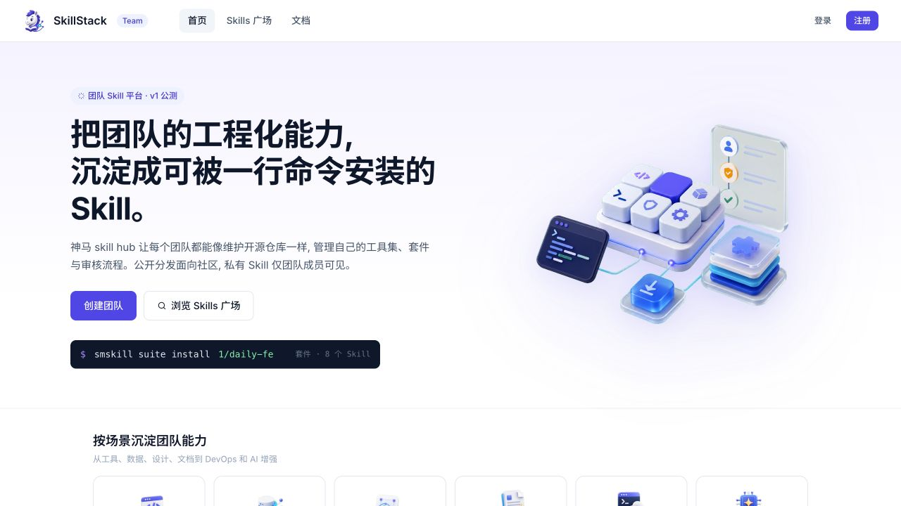
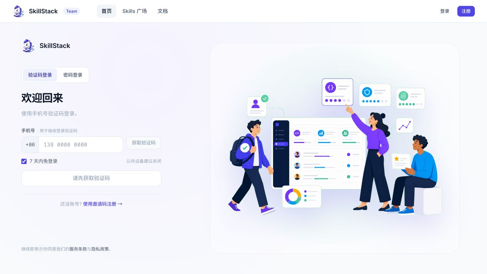
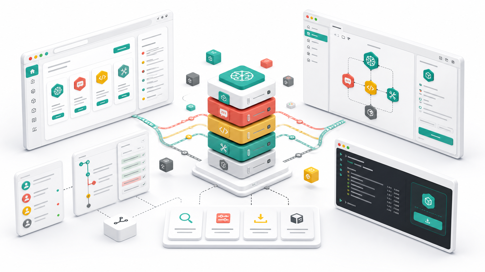
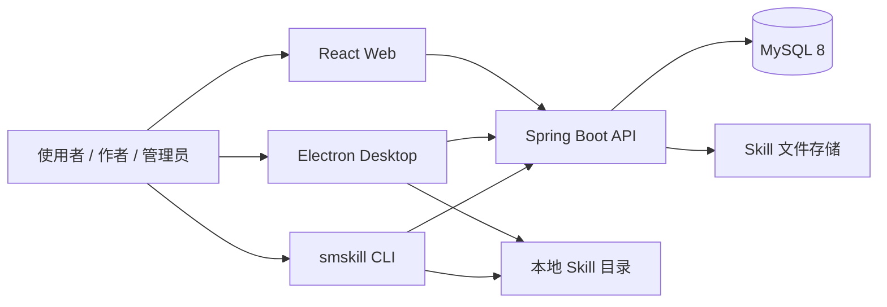

# SkillStack

<p align="center">
  面向个人、团队与社区的 AI Skill 开放平台：发现、沉淀、审核、发布和安装可复用的工程能力。
</p>

<p align="center">
  <a href="#快速开始">快速开始</a> ·
  <a href="#核心功能">核心功能</a> ·
  <a href="#桌面客户端">桌面客户端</a> ·
  <a href="#roadmap">Roadmap</a> ·
  <a href="#参与贡献">参与贡献</a>
</p>



SkillStack 希望让 Skill 像开源软件包一样易于维护和复用。作者可以持续发布版本，团队可以建立审核和权限边界，使用者则可以通过 Web、桌面客户端或 `smskill` CLI 搜索并安装能力资产。

> 项目正在持续开发中，API、数据模型和客户端行为仍可能调整。欢迎通过 Issue 参与需求讨论、提交问题和完善文档。

## 为什么是 SkillStack

- **不止是下载站**：覆盖创建、版本、审核、发布、收藏、安装和反馈闭环。
- **团队与社区并存**：公开 Skill 面向社区发现，团队资产遵循成员权限和审核策略。
- **多端入口**：同时提供 Web 管理端、Electron 桌面客户端和终端 CLI。
- **可私有化部署**：前后端分离，使用 MySQL 持久化，并提供 Docker、Nginx 与 Jenkins 示例。
- **面向长期演进**：正在建设订阅同步、多设备一致性、作者数据和团队资产健康度。

## 界面预览

### Web 首页



### 登录与账户入口



更多产品视觉探索：



> Web 截图来自当前仓库实际运行页面；生态设计图使用 `gpt-image-2` 生成，用于表达产品的多端协作方向，不代表最终 UI。

## 核心功能

| 能力 | 使用者 | Skill 作者 | 团队管理员 |
|---|---|---|---|
| 公共广场 | 搜索、分类浏览、查看详情与版本 | 公开展示已审批内容 | 管理平台公共资产 |
| 团队工作区 | 使用团队 Skill、Prompt 与 Suite | 创建并维护团队资产 | 管理成员、邀请和团队设置 |
| 发布与审核 | 获取可信版本 | 上传 Skill 包、提交新版本、查看审核结果 | 审核文件、评论并批准或拒绝 |
| Skill Suite | 一次安装一组相关 Skill | 组合可复用能力包 | 维护团队推荐套件 |
| Prompt Library | 发现和复用团队 Prompt | 创建、编辑和迭代 Prompt | 管理团队 Prompt 资产 |
| 通知中心 | 接收审核、版本和团队动态 | 跟踪发布反馈 | 处理团队事件 |
| 平台管理 | - | - | 管理用户、团队、Skill、Suite、OAuth 与站点配置 |
| 多端安装 | Web 浏览，CLI/桌面端执行安装 | 从本地上传和持续发布 | 统一团队分发入口 |

### 典型工作流

1. 作者创建 Skill，上传包含 `SKILL.md` 的 Skill 包并提交审核。
2. 审核者查看版本文件、补充评论并作出审批决定。
3. 审批通过后，Skill 出现在团队空间或公共广场。
4. 使用者通过桌面客户端或 `smskill install` 安装到本地工具目录。
5. 后续版本继续沿用发布与审核流程，逐步形成可追踪的团队能力资产。

## 桌面客户端

仓库内的 `desktop/` 是独立 Electron 客户端，不是 Web 页面的简单壳。它面向“发现后立即安装”和“管理本机 Skill”这两类高频场景。

当前客户端包含：

- 登录与 SkillStack API 连接。
- 公共广场和推荐内容浏览。
- 本机 Skill 扫描、导入、安装、卸载与分组展示。
- Skill 包校验、ZIP 解包和安装冲突处理。
- 支持 `~/.skillstack/skills`、`~/.agents/skills` 等安装目标。
- 设置页、确认弹窗、错误日志与日志导出。
- macOS、Windows、Linux 构建配置。

```bash
# 安装 monorepo 依赖
npm install

# 启动桌面端渲染进程（http://127.0.0.1:5174）
npm --workspace desktop run dev

# 另一个终端启动 Electron
npm --workspace desktop run dev:electron
```

打包命令：`npm --workspace desktop run dist:mac`、`dist:win`、`dist:linux`。

## CLI

`smskill` 是 Node.js 20+ 终端客户端，适合脚本化安装、团队初始化和无 GUI 环境。

```bash
npm install -g smskill

smskill search "code review"
smskill info <skill-slug>
smskill install <skill-slug>
smskill suite install <team>/<suite>
smskill list
```

已实现的命令覆盖 `auth`、`config`、`search`、`info`、`install`、`list`、`remove`、`suite`、`prompt`、`team` 和 `upload`。完整说明见 [`cli/README.md`](cli/README.md)。

## 系统架构



### 技术栈

| 模块 | 技术 |
|---|---|
| Web | React 18、TypeScript 5、Vite 5、React Router 6、TanStack Query 5、Zustand、Tailwind CSS、Radix UI、Tiptap、Vitest |
| Desktop | Electron 33、React 18、Vite、TypeScript、electron-builder、electron-log、Vitest |
| CLI | Node.js 20+、Commander、Axios、Zod、Inquirer、Chalk、tsup、Vitest |
| Backend | Java 17、Spring Boot 3.2、Spring Security、MyBatis Plus、JWT、Flyway、springdoc-openapi |
| Data & Delivery | MySQL 8、Docker Compose、Nginx、Jenkins |

## 快速开始

### 环境要求

- Node.js 20+
- Java 17+
- Maven 3.9+
- MySQL 8（可使用仓库提供的 Docker Compose）
- macOS / Linux；Windows 建议使用 WSL 运行服务脚本

### 1. 准备数据库

```bash
docker compose up -d mysql
```

本地 Compose 默认将 MySQL 映射到 `3307`。生产环境请使用独立强密码和环境变量，切勿沿用开发配置。

### 2. 启动 Web 与后端

```bash
./scripts/services.sh start
./scripts/services.sh status
```

| 服务 | 地址 |
|---|---|
| Web | http://localhost:5173 |
| Backend API | http://localhost:8080 |
| Swagger UI | http://localhost:8080/swagger-ui.html |
| MySQL | localhost:3307 |

`scripts/services.sh` 只管理 Web 和 Backend，不会启动或停止 MySQL。停止应用服务：

```bash
./scripts/services.sh stop
```

更细的开发和排障说明见 [`AGENT.md`](AGENT.md)，生产部署见 [`deploy/README.md`](deploy/README.md)。

## 项目结构

```text
.
├── backend/        # Spring Boot API、领域服务与 Flyway migration
├── frontend/       # React Web：公共广场、团队空间、管理后台
├── desktop/        # Electron 桌面客户端与本地 Skill 生命周期
├── cli/            # npm 包 smskill
├── packages/ui/    # Web 与 Desktop 共用的 UI 组件和 token
├── deploy/         # Docker、Nginx、Jenkins 部署资料
├── docs/           # 产品设计、实现计划、测试资料与图片
└── scripts/        # 本地服务管理脚本
```

## Roadmap

近期目标围绕“客户端 + 同步 + 持续发布 + 统计”展开，服务使用者、作者和团队管理员三类角色。

| 阶段 | 目标 | 状态 |
|---|---|---|
| Phase 0 | 客户端形态与同步引擎边界 | 已完成 Electron 客户端基础形态 |
| Phase 1 | 订阅、设备、统计、审核策略、生命周期、依赖与通知 API | 规划中 |
| Phase 2 | 我的订阅、作者看板、团队资产看板和管理配置 | 规划中 |
| Phase 3 | 桌面同步、批量升级、一键同步、作者发布与离线重放 | 进行中 |
| Phase 4 | CLI 与桌面端统一订阅、安装和升级语义 | 规划中 |
| Phase 5 | 核心旅程 E2E、多设备一致性和依赖链路验证 | 规划中 |

重点 TODO：

- [ ] 用户级订阅与多设备安装状态
- [ ] 批量升级、跳过版本和新设备一键同步
- [ ] Skill 依赖声明、联动安装与循环依赖检测
- [ ] 作者侧订阅、安装、活跃和版本分布统计
- [ ] 团队 Skill 健康度、覆盖率和版本一致性看板
- [ ] 团队级审核策略：`always` / `first_only` / `none`
- [ ] 下架与不可撤回版本的完整生命周期
- [ ] 完善桌面端离线模式、同步重放和桌面通知
- [ ] 补齐社区治理文档、贡献指南和开源许可证

完整拆分与依赖关系见 [`ROADMAP.md`](ROADMAP.md)，详细产品设计见 [`docs/superpowers/specs/2026-05-27-skill-client-sync-publish-design.md`](docs/superpowers/specs/2026-05-27-skill-client-sync-publish-design.md)。

## 参与贡献

我们欢迎以下类型的贡献：

- 报告可复现的 Bug，附带环境、触发步骤、预期和实际结果。
- 讨论 Skill 分发、审核、同步和团队治理的产品方案。
- 改进文档、测试、无障碍体验和跨平台兼容性。
- 提交小而聚焦的 Pull Request，并为行为变化补充验证。

开始编码前请先阅读 [`AGENT.md`](AGENT.md) 中的工程约定。推荐流程：

1. 创建或认领 Issue，先收敛问题边界。
2. Fork 仓库并从最新主分支创建功能分支。
3. 只修改与目标直接相关的模块，并运行定向测试、lint 或 build。
4. 在 PR 中说明背景、方案、验证结果以及界面变化截图。

## 开源状态

仓库已公开代码和开发资料，但当前尚未包含正式 `LICENSE` 文件，CLI 包元数据也仍为 `UNLICENSED`。在许可证补齐前，请不要假设代码已按某种 OSI 许可证授权；许可证选择是 Roadmap 中的优先事项。

---

如果 SkillStack 对你的团队有帮助，欢迎 Star、提交 Issue，或把你希望被标准化和复用的工作流带进社区讨论。
