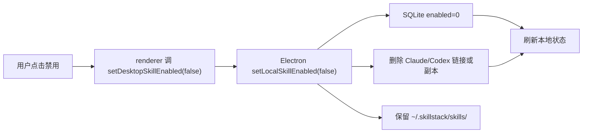
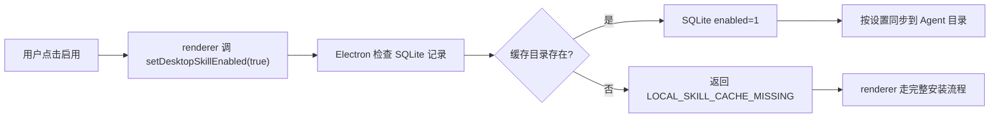

# 桌面端 Skill 生命周期一致性设计

- 状态：设计已确认，待实施
- 日期：2026-06-03
- 范围：桌面端 Skill 安装、禁用、启用、更新、删除、同步方式切换；涉及服务数据库、本地 SQLite、`~/.skillstack/skills/<slug>` 缓存目录、Claude/Codex Agent skills 目录
- 关联计划：`docs/superpowers/plans/2026-06-03-desktop-skill-lifecycle-consistency.md`

## 1. 背景

当前桌面端出现两个状态一致性问题：

1. 广场 Skill 已经添加到“我的 Skills”，但本地禁用后，广场卡片又显示为可安装。
2. 在“我的 Skills”中禁用 `lark-task`、`skillstack-installer` 后，开关状态会回弹，甚至两个 Skill 都重新变成启用。

根因不是单个按钮判断错误，而是代码把多个状态混成了一个布尔值：

- 服务数据库是否有记录。
- 本地 SQLite 是否有记录。
- SQLite enabled 字段是否启用。
- `~/.skillstack/skills/<slug>` 缓存目录是否存在。
- Claude/Codex 的 `skills` 目录是否存在软链接或复制副本。

其中 `Boolean(view.local)` 被多处当成“已安装/已启用”，导致“已添加但禁用”“有缓存但未启用”“本地记录存在但 Agent 不生效”这些状态无法表达。

## 2. 目标

本次设计目标：

1. 明确四层状态的含义。
2. 统一安装、禁用、启用、更新、删除的副作用。
3. 禁用时保留缓存目录，只移除 Agent 目录链接或副本。
4. 设置页切换软链接/复制时，不修改缓存目录内容。
5. 广场与我的 Skills 使用同一套状态语义。
6. 失败回滚路径与禁用路径分离，避免用“删除”实现“禁用”。

## 3. 非目标

本次不做：

1. 不新增云端设备表。
2. 不做多设备安装状态同步。
3. 不改 Skill 发布审核流程。
4. 不重构整个桌面端页面结构。
5. 不修改 Agent 目录之外的 Claude/Codex 行为。
6. 不改变服务端“我的 Skills”主数据语义，只修正桌面端生命周期一致性。

## 4. 核心状态模型

四层状态必须独立理解：

| 层级 | 位置 | 含义 | 是否源头 |
|---|---|---|---|
| 服务数据库 | `user_skills` 等 | 用户是否已添加该 Skill | 是 |
| 本地 SQLite | `~/.skillstack/skillstack.db` | 当前设备是否纳入本地管理 | 是 |
| 本地缓存目录 | `~/.skillstack/skills/<slug>` | 当前设备是否已有可同步的 Skill 文件 | 是 |
| Agent 生效目录 | `~/.claude/skills/<slug>`、`~/.codex/skills/<slug>` | 是否对对应 Agent 生效 | 否，是同步结果 |

SQLite 的 `enabled_claude`、`enabled_codex` 表示是否启用到对应 Agent。

Agent 生效目录不是状态源头。它只是由 SQLite enabled 状态、缓存目录、同步方式共同生成的结果。

## 5. 状态定义

### 5.1 已添加

服务数据库有记录即表示“已添加”。

影响：

1. 广场卡片显示 `√`。
2. 详情显示“已添加”或“已安装”，不能显示“可安装”。
3. 即使本地禁用或本地缓存缺失，仍然不能回到“未添加”语义。

### 5.2 已安装 / 已启用

满足以下条件才表示“已安装/已启用”：

1. 本地 SQLite 有记录。
2. 对应 enabled 字段为 true。
3. Agent 目录中存在对应软链接或复制副本。
4. 缓存目录存在。

UI 判断时以 SQLite enabled 字段为主，Agent 目录作为同步结果校验，不作为直接状态源头。

### 5.3 已禁用

满足以下条件表示“已禁用”：

1. 服务数据库记录存在。
2. 本地 SQLite 记录存在。
3. SQLite enabled 字段为 false。
4. 缓存目录保留。
5. Agent 目录中没有该 Skill 的链接或副本。

### 5.4 本地缓存存在但未启用

这是合法状态。

语义：

1. 用户已经添加过该 Skill。
2. 当前设备仍有缓存。
3. 当前 Agent 不生效。
4. 点击启用时应复用缓存，不重新下载。

### 5.5 本地缓存缺失但云端已添加

这是合法但需要恢复的状态。

语义：

1. 服务数据库仍然表示“已添加”。
2. 当前设备没有可复用缓存。
3. 点击启用时必须走完整安装/下载流程。

## 6. 生命周期语义

### 6.1 安装

安装必须按以下顺序完成：

1. 写服务数据库。
2. 写本地 SQLite。
3. 写 `~/.skillstack/skills/<slug>` 缓存目录。
4. 根据当前设置同步到 Claude/Codex Agent 目录。

如果本地安装失败，必须回滚：

1. 删除服务数据库记录。
2. 删除本地 SQLite 记录。
3. 删除本次安装产生的缓存目录。
4. 删除本次安装产生的 Agent 目录链接或副本。

安装失败回滚是删除语义，不是禁用语义。

### 6.2 禁用

禁用必须做到：

1. 不删除服务数据库记录。
2. 不删除本地 SQLite 记录。
3. 修改 SQLite enabled 字段为 false。
4. 不删除 `~/.skillstack/skills/<slug>` 缓存目录。
5. 删除 Claude/Codex Agent 目录中的软链接或复制副本。

禁用流程不能调用会删除缓存目录或 SQLite 记录的卸载 API。

### 6.3 启用

启用必须做到：

1. 修改 SQLite enabled 字段为 true。
2. 如果缓存目录存在，根据当前同步方式创建软链接或复制副本到 Agent 目录。
3. 如果缓存目录不存在，返回缓存缺失错误，由上层走完整安装流程。

启用不应该默认重新下载。只有缓存缺失时才重新安装。

### 6.4 更新

更新必须做到：

1. 广场/团队 Skill 从服务端 `Skills` 表或版本表取最新信息。
2. 更新服务数据库中该用户 Skill 的版本等快照字段。
3. 更新本地 SQLite 版本字段。
4. 更新 `~/.skillstack/skills/<slug>` 缓存目录。
5. 如果当前 enabled 为 true，同步到 Agent 目录。
6. 如果当前 enabled 为 false，只更新缓存目录，不同步 Agent 目录。

### 6.5 删除

删除必须做到：

1. 删除服务数据库记录。
2. 删除本地 SQLite 记录。
3. 删除 `~/.skillstack/skills/<slug>` 缓存目录。
4. 删除 Claude/Codex Agent 目录中的软链接或复制副本。

删除是完整清理，和禁用严格区分。

### 6.6 切换软链接/复制方式

切换同步方式必须做到：

1. 不修改服务数据库。
2. 不修改 SQLite enabled 状态。
3. 不修改 `~/.skillstack/skills/<slug>` 缓存目录内容。
4. 删除旧的 Agent 目录同步结果。
5. 只为 enabled=true 的 Skill 按新方式重建 Agent 目录。
6. disabled Skill 不得被重新同步到 Agent 目录。

## 7. UI 语义

### 7.1 广场卡片

广场卡片判断规则：

| 条件 | 显示 |
|---|---|
| 服务数据库有记录 | `√` |
| 服务数据库无记录 | `+` |

不能因为本地禁用或缓存缺失，把已添加 Skill 显示为 `+`。

### 7.2 广场详情

详情状态规则：

| 条件 | 显示 |
|---|---|
| enabled=true 且本地缓存存在 | 已安装 |
| 服务数据库有记录但未启用 | 已添加 |
| 服务数据库无记录 | 可安装 |

### 7.3 我的 Skills 开关

开关 checked 只能由 SQLite enabled 字段决定：

```ts
Boolean(local.enabledClaude || local.enabledCodex)
```

不能使用：

```ts
Boolean(view.local)
```

### 7.4 我的 Skills 操作

| 操作 | 调用语义 |
|---|---|
| 禁用 | set-enabled false |
| 启用且缓存存在 | set-enabled true |
| 启用但缓存缺失 | 完整安装 |
| 删除 | 完整删除 |
| 更新且启用 | 更新缓存 + 同步 Agent |
| 更新且禁用 | 更新缓存，不同步 Agent |

## 8. 本地 API 设计

### 8.1 保留删除 API

现有删除/卸载 API 继续表示完整清理：

```ts
uninstallSkill(slug)
removeLocalSkillRecord({ userSkillId, slug })
```

这些 API 用于：

1. 删除 Skill。
2. 安装失败回滚。
3. 清理本地残留。

不得用于禁用。

### 8.2 新增启用/禁用 API

新增：

```ts
setLocalSkillEnabled({
  userSkillId?: number;
  slug?: string;
  enabled: boolean;
})
```

行为：

1. 查找 SQLite 记录。
2. 更新 enabled 字段。
3. 删除旧 Agent 目录同步结果。
4. 如果 enabled=true，检查缓存目录并重新同步。
5. 如果 enabled=false，保留缓存目录。

错误：

| 错误 | 含义 |
|---|---|
| `LOCAL_SKILL_NOT_FOUND` | SQLite 记录不存在 |
| `LOCAL_SKILL_CACHE_MISSING` | 启用时缓存目录不存在 |

### 8.3 新增重建同步 API

新增：

```ts
resyncEnabledSkillRecords()
```

用于设置页切换软链接/复制方式后重建 Agent 目录。

行为：

1. 读取所有 SQLite 记录。
2. 删除旧 Agent 目录同步结果。
3. 只处理 enabled=true 的记录。
4. 从缓存目录重新创建软链接或复制副本。
5. 不修改缓存目录内容。

## 9. 数据流

### 9.1 禁用数据流



### 9.2 启用数据流



### 9.3 切换同步方式数据流


## 10. copy 模式删除策略

软链接删除简单，直接删除 symlink。

copy 模式的难点是复制副本的 realpath 不等于缓存目录 realpath，因此不能继续只用 realpath 判断。

建议策略：

1. 如果目标是 symlink，直接删除。
2. 如果目标是 directory，且目录中存在 `SKILL.md`，并且目标路径是由配置的 Claude/Codex skills 目录 + slug 生成，则允许删除。

待确认风险：

1. 如果用户手动在 Claude/Codex skills 目录创建了同 slug 且包含 `SKILL.md` 的目录，可能被当成同步副本删除。
2. 更稳妥方案是在 copy 副本里写 `.skillstack-sync.json` 标记，只删除带标记的目录。
3. 但历史 copy 副本没有标记，需要兼容迁移。

本次建议先按 `slug + SKILL.md + Agent skills 目录路径` 处理历史副本，同时在后续版本考虑引入同步标记文件。

## 11. 测试策略

### 11.1 Electron 本地状态测试

覆盖：

1. `listLocalInstalls()` 返回 enabled 字段。
2. 禁用保留 SQLite 和缓存目录。
3. 禁用删除 Claude/Codex 目录链接或副本。
4. 启用复用缓存目录。
5. copy 模式副本能被删除。
6. 切换同步方式不修改缓存目录。
7. disabled Skill 不会因切换同步方式重新同步。

### 11.2 renderer 状态合并测试

覆盖：

1. 服务数据库有记录时，广场视为已添加。
2. enabled=false 时不显示为已安装。
3. enabled=false 时不显示为可安装。
4. 本地缓存缺失但云端已添加时，仍保留“已添加”语义。

### 11.3 UI 测试

覆盖：

1. 禁用按钮调用 set-enabled，不调用 uninstall。
2. 启用按钮优先调用 set-enabled。
3. 缓存缺失时启用降级为完整安装。
4. 详情弹窗区分“已安装”和“已添加”。

### 11.4 手工验证

必须验证：

1. 广场添加并安装。
2. 禁用后广场仍显示 `√`。
3. 禁用后 Agent 目录移除，缓存目录保留。
4. 启用后复用缓存并恢复 Agent 目录。
5. 切换软链接/复制方式不修改缓存目录。
6. disabled Skill 不因切换方式重新出现。
7. 删除后四层全部清理。

## 12. 兼容性和风险

### 12.1 历史 SQLite 记录

SQLite 已有 `enabled_claude`、`enabled_codex` 字段。需要确保：

1. 老记录读取时能正常转成 boolean。
2. `recordToInstallEntry()` 不再丢字段。
3. upsert 时保留已有 enabled 状态，不因为更新版本把 disabled 变 enabled。

### 12.2 历史 Agent 目录副本

历史 copy 副本可能没有同步标记文件。

处理方式：

1. 本次通过 `SKILL.md` 判断可删除。
2. 标记为待确认风险。
3. 后续可以引入 `.skillstack-sync.json` 降低误删风险。

### 12.3 安装失败回滚

安装失败回滚必须使用完整删除语义。

不能把安装失败变成 disabled 状态，否则会留下服务数据库或 SQLite 脏记录。

### 12.4 更新 disabled Skill

更新 disabled Skill 时，只更新缓存，不同步 Agent 目录。

否则用户禁用后，只要后台更新或手动更新，就会重新启用。

## 13. 验收标准

功能验收：

1. 只要服务数据库有记录，广场卡片显示 `√`。
2. 禁用后服务数据库记录仍在。
3. 禁用后 SQLite 记录仍在，enabled 为 false。
4. 禁用后 `~/.skillstack/skills/<slug>` 仍在。
5. 禁用后 Claude/Codex Agent 目录没有该 Skill。
6. 启用后从缓存恢复 Agent 目录。
7. 删除后服务数据库、SQLite、缓存目录、Agent 目录全部清理。
8. 切换软链接/复制方式不会修改缓存目录内容。
9. disabled Skill 不会因为切换同步方式或刷新页面变回 enabled。

技术验收：

1. 不再用 `Boolean(view.local)` 表示启用状态。
2. 禁用流程不调用删除缓存或删除 SQLite 的 API。
3. 删除流程仍完整清理四层状态。
4. Electron、preload、renderer 类型中的 enabled 字段一致。
5. 目标测试通过。
6. `cd desktop && npm run lint` 通过。

## 14. 与实施计划的关系

本文档定义“应该是什么”。

实施计划 `docs/superpowers/plans/2026-06-03-desktop-skill-lifecycle-consistency.md` 定义“怎么一步步改”。

实施时以本文档的状态语义为准；如果计划步骤与本文档冲突，以本文档为准，并先修订计划。
